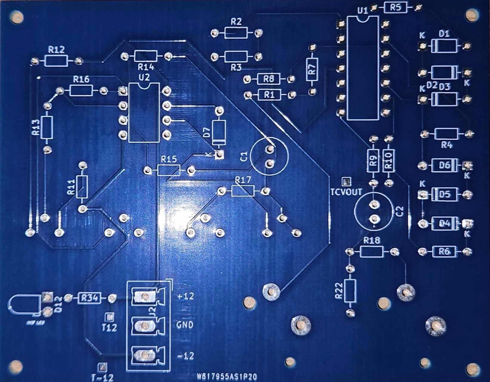
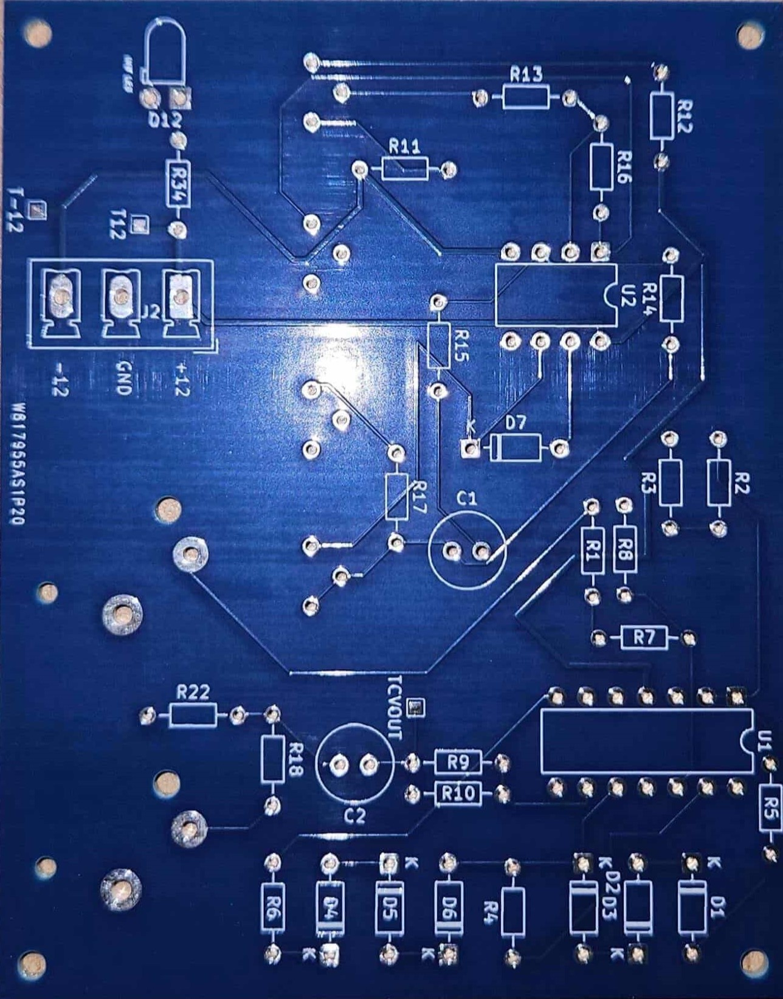
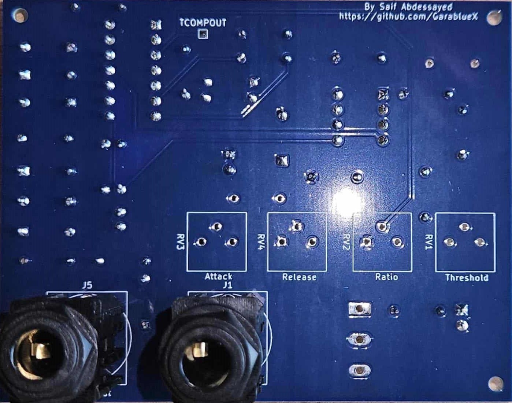
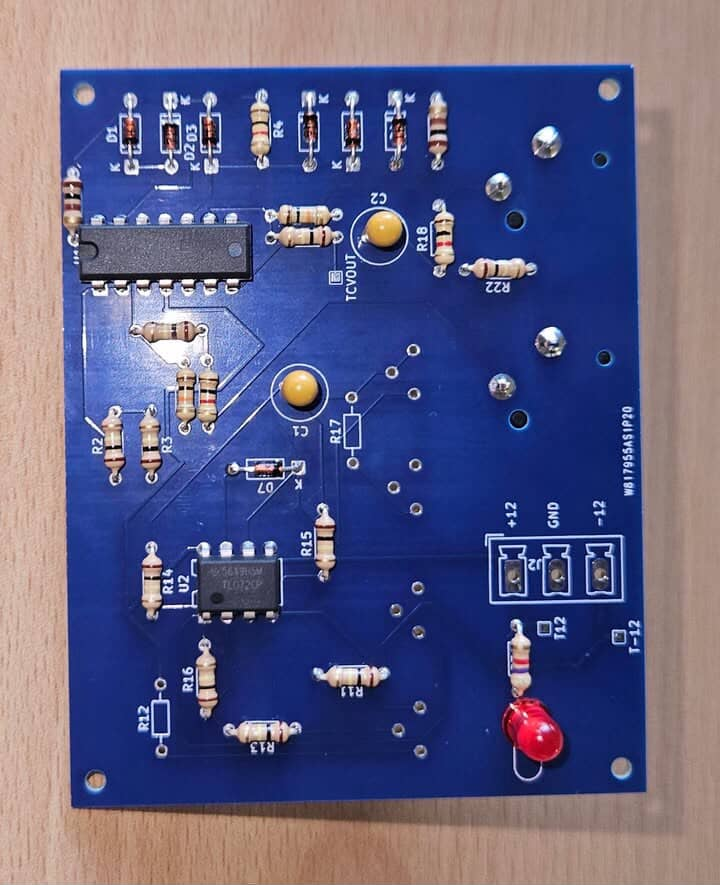

# Real-Time Adaptive Signal Conditioning System

[](https://www.pcbway.com/)
[](LICENSE)

---

## Manufacturing Partnership

This project is sponsored by [**PCBWay**](https://www.pcbway.com/), a leading PCB manufacturing service provider.

PCBWay is supporting the fabrication of prototype hardware for this system, enabling real-world validation and testing beyond simulation. Their sponsorship demonstrates commitment to supporting engineering education and open-source development.

**Fabrication Status:** Finished

**Manufacturing Partner:** [PCBWay - Professional PCB Services](https://www.pcbway.com/)

---
### Project Gallery












*PCBs manufactured by [PCBWay](https://www.pcbway.com/) - Professional quality for precision analog circuits*

## Overview

This repository documents an engineering project focused on the design and simulation of a **Real-Time Adaptive Signal Conditioning System for Wide Dynamic Range Inputs**.

The system automatically regulates signal amplitude through level-dependent adaptive gain control, ensuring stable output behavior despite significant variations in input magnitude. While the principles draw from audio dynamic range compression, the project is framed as a generic signal conditioning and control system applicable to various engineering domains.

---

##  Technical Specifications

| Parameter | Specification |
|-----------|--------------|
| Supply Voltage | ±12V DC |
| Power Consumption | ~320mW (typical) |
| Maximum Input | 12Vpp (6V peak) |
| Frequency Response | 20Hz – 20kHz |
| Attack Time Range | 1ms – 100ms (adjustable) |
| Release Time Range | 50ms – 1.05s (adjustable) |
| Compression Ratio | 1:1 to ∞:1 (variable) |
| PCB Layers | 2-layer FR4 |
| Total Component Cost | ~$25 USD / 75 TND |

---

##  Key Features

### Core System
- **Feed-forward compression architecture** - Fast response time
- **Diode ladder voltage-controlled amplifier** - Cost-effective, low distortion
- **Precision envelope detection** - Accurate signal level monitoring
- **Adjustable threshold, attack, release, and ratio controls**
- **Input protection circuitry** - Zener clamp at 6.2V

### Optional Modules
- **Variable makeup gain amplifier** - Output level control
- **5-stage LED level indicator** - Visual feedback
- **Modular implementation** - Use only what you need

---

## Project Objectives

- Design a real-time adaptive gain control system  
- Handle wide input dynamic ranges without saturation  
- Apply control-system principles to signal conditioning  
- Validate system behavior through simulation  
- Develop manufacturable PCB implementation
- Present the design in a clear, engineering focused manner  

---


## Key Engineering Concepts

- Adaptive gain control  
- Dynamic range regulation  
- Real-time signal processing  
- Feed forward control architecture  
- Time domain system response (attack and release behavior)  

These concepts are demonstrated using standard analog test signals, such as sine waves and amplitude step inputs.

---

## Validation & Testing

System validation is conducted via circuit level simulation:

- Time-domain waveform analysis  
- Input versus output amplitude characterization  
- Gain response under varying signal levels  

Simulation is employed to isolate system behavior and verify functional correctness under controlled conditions.

---

##  Documentation

**Complete technical documentation available in `/Report.pdf`**

The comprehensive report includes:
- Theoretical background and system architecture
- Detailed circuit analysis for each functional block
- Simulation results and validation methodology
- PCB design considerations and layout strategy
- Bill of materials and cost analysis
- Power consumption analysis and thermal considerations
- Design iterations and problem-solving process

---

## PCB Implementation

Following simulation validation, the system has been designed for physical implementation:

- **PCB Design Tool:** KiCAD
- **PCB Specifications:** 2-layer FR4, standard manufacturing
- **Design Approach:** Modular layout, ground plane strategy, optimized trace routing
- **Manufacturing Partner:** [PCBWay](https://www.pcbway.com/)

The PCB design translates the validated circuit architecture into a manufacturable format suitable for prototype fabrication and testing.

**Current Status:** Gerber files generated, PCBs in production with PCBWay.

---

## Tools & Environment

- **Simulation Environment:** Proteus  
- **PCB Design:** KiCAD
- **Signal Type:** Analog test signals (audio-frequency range used for convenience)  
- **Methodology:** Design → Simulate → Analyze → Validate → Implement

---

## Project Status

**Completed:**
-  Core system design  
-  Functional simulation and validation
-  PCB layout and design
-  Manufacturing file preparation
-  PCB fabrication
-  Prototype assembly
-  

**In Progress:**
-  Physical testing and validation (scheduled)

Updates will be posted as i move on to the next steps.

---

## Acknowledgments

**Manufacturing Partner:**  
[**PCBWay**](https://www.pcbway.com/) - PCB fabrication sponsorship enabling physical prototype development and testing.

**Academic Context:**  
This project was developed as part of engineering studies at ISE'TCOM, with internship framework provided by ISET Sousse.

---

## Repository Structure

```
├── PCB-images/              # Technical documentation
├── Schematics in KiCad/          # KiCAD PCB design files
├── Schematics(for simulation)/           # Manufacturing files
├── topologys/        # Proteus simulation files
├── additional footprints & 3D models used/               # Foot prints and 3D models 
├── images/            # Schematics and renders
├── Report.pdf/
```

---


##  Contact & Collaboration

**Project Author:** Saif Abdessayed   


- **Email:** saif.abdessayed321@gmail.com
- **GitHub:** [@GarablueX](https://github.com/GarablueX)
- **LinkedIn:**[Saif Abd'Essayed](https://www.linkedin.com/in/saif-abdessayed/)


**Interested in collaborating?** Open an issue or pull request!

**Questions about the design?** Check the documentation or open a discussion.

---

**Last Updated:** April 2026  
**Version:** 1.2 - PCB fabrication Done

---
## License

This project is shared for educational and portfolio purposes only.


